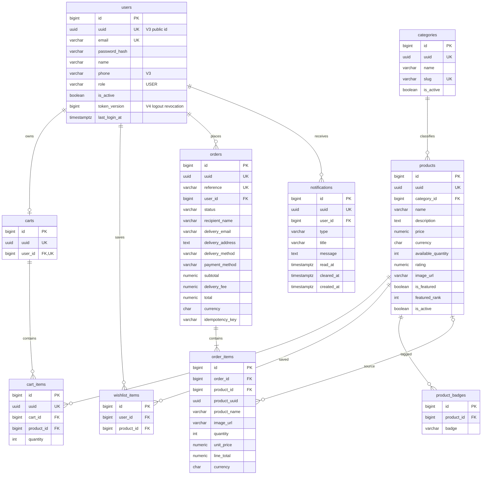

# Data model

## 1. Overview

PostgreSQL relational model for the scaffolded backend and the approved v1 target schema.

Companion documents:

- [API conventions](api-convention.md)
- [API specification](api-specification.md)
- [Backend initialization blueprint](backend/backend-init-blueprint.md)

> **Implementation boundary:** Migrations V1 through V6 are currently applied. V7 and V8 remain
> planned.

## 2. Conventions

- Tables and columns use `snake_case`; tables are plural.
- Internal primary and foreign keys use `BIGINT`.
- API-addressable entities have a unique public `UUID`. `V3` adds it to the scaffolded `users` table.
- Mutable tables have `created_at` and `updated_at` as `TIMESTAMPTZ`.
- Money uses `NUMERIC(12,2)` and a three-character currency code.
- Enum-like fields use `VARCHAR` plus `CHECK` constraints.
- Passwords are stored only as adaptive one-way hashes. Refresh JWTs are not stored server-side.
- Cart totals are derived. Order prices and totals are stored snapshots.
- Prototype labels and counters are stored only when they represent business state. Initials,
  relative dates, unread/cart counts, and stock labels are derived by the API or client.
- Applied migrations are sequential and are never edited.

## 3. Main entities

| Group | Entities | Status |
|---|---|---|
| Identity | `users` | Implemented in `V1`, seeded by `V2`, and extended by `V3` and `V4`. |
| Catalog | `categories`, `products`, `product_badges` | Implemented in `V5`. |
| Shopping | `carts`, `cart_items`, `wishlist_items` | Schema applied in `V6`; cart APIs implemented, wishlist APIs planned. |
| Orders | `orders`, `order_items` | Planned `V7`. |
| Notifications | `notifications` | Planned `V8`. |

Deferred entities: product variants, reviews, saved addresses, inventory movements, promotions,
payments, shipments, returns, notification preferences, and audit entries.

The course's suggested `Product Images` and `Addresses` concepts are represented by the approved v1
requirements without extra tables: `products.image_url` stores the single catalog image, while each
order stores an immutable delivery-address snapshot. Separate `product_images` and `addresses`
tables should be introduced only when multiple images or reusable saved addresses enter the API.

## 4. Entity relationship diagram



## 5. DDL

The first six migrations are applied. Later blocks are the approved target DDL and retain their
planned sequence so implementation does not collide with existing migration names.

### 5.1 Applied identity schema — `V1` and `V2`

```sql
-- V1__create_users.sql
CREATE TABLE users (
    id              BIGSERIAL    PRIMARY KEY,
    email           VARCHAR(255) NOT NULL,
    password_hash   VARCHAR(255) NOT NULL,
    name            VARCHAR(100) NOT NULL,
    role            VARCHAR(20)  NOT NULL DEFAULT 'USER',
    is_active       BOOLEAN      NOT NULL DEFAULT TRUE,
    last_login_at   TIMESTAMPTZ,
    created_at      TIMESTAMPTZ  NOT NULL,
    updated_at      TIMESTAMPTZ  NOT NULL,

    CONSTRAINT chk_users_role
        CHECK (role = 'USER')
);

CREATE UNIQUE INDEX uq_users_email ON users (lower(email));

-- V2__seed_users.sql
-- Seeds user@example.com as one development USER account with a bcrypt hash.
-- The migration is already named/applied and cannot be reused.
```

`V2__seed_users.sql` is scaffold seed data, not schema. Before the first deployed environment, decide
whether these reserved `@example.com` rows are acceptable there; never add real credentials to a
migration.

### 5.2 Complete user API fields — applied `V3`

The API contract exposes a UUID and optional phone, but the scaffolded entity/table does not contain
them. Add both through a new migration and update `User` in the same change.

```sql
-- V3__add_user_public_fields.sql
CREATE EXTENSION IF NOT EXISTS pgcrypto;

ALTER TABLE users ADD COLUMN uuid UUID;
UPDATE users SET uuid = gen_random_uuid() WHERE uuid IS NULL;
ALTER TABLE users ALTER COLUMN uuid SET NOT NULL;
ALTER TABLE users ADD CONSTRAINT uq_users_uuid UNIQUE (uuid);

ALTER TABLE users ADD COLUMN phone VARCHAR(32);
```

### 5.3 Account-wide token revocation — applied `V4`

JWT payloads remain stateless. The version is included in both token types and incremented on
logout, invalidating every earlier access and refresh token for the account.

```sql
-- V4__add_user_token_version.sql
ALTER TABLE users
    ADD COLUMN token_version BIGINT NOT NULL DEFAULT 0,
    ADD CONSTRAINT chk_users_token_version CHECK (token_version >= 0);
```

### 5.4 Catalog — applied `V5`

```sql
-- V5__create_catalog.sql
CREATE TABLE categories (
    id          BIGSERIAL    PRIMARY KEY,
    uuid        UUID         NOT NULL UNIQUE,
    name        VARCHAR(120) NOT NULL,
    slug        VARCHAR(140) NOT NULL UNIQUE,
    is_active   BOOLEAN      NOT NULL DEFAULT TRUE,
    created_at  TIMESTAMPTZ  NOT NULL,
    updated_at  TIMESTAMPTZ  NOT NULL
);

CREATE TABLE products (
    id                  BIGSERIAL      PRIMARY KEY,
    uuid                UUID           NOT NULL UNIQUE,
    category_id         BIGINT         NOT NULL REFERENCES categories(id) ON DELETE RESTRICT,
    name                VARCHAR(180)   NOT NULL,
    description         TEXT,
    price               NUMERIC(12,2)  NOT NULL,
    currency            CHAR(3)        NOT NULL DEFAULT 'USD',
    available_quantity  INTEGER        NOT NULL DEFAULT 0,
    rating              NUMERIC(2,1),
    image_url           VARCHAR(2048),
    is_featured         BOOLEAN        NOT NULL DEFAULT FALSE,
    featured_rank       INTEGER,
    is_active           BOOLEAN        NOT NULL DEFAULT TRUE,
    created_at          TIMESTAMPTZ    NOT NULL,
    updated_at          TIMESTAMPTZ    NOT NULL,

    CONSTRAINT chk_products_price
        CHECK (price >= 0),
    CONSTRAINT chk_products_quantity
        CHECK (available_quantity >= 0),
    CONSTRAINT chk_products_rating
        CHECK (rating IS NULL OR rating BETWEEN 0 AND 5),
    CONSTRAINT chk_products_featured_rank
        CHECK (
            (is_featured AND featured_rank IS NOT NULL AND featured_rank >= 0)
            OR (NOT is_featured AND featured_rank IS NULL)
        ),
    CONSTRAINT chk_products_currency
        CHECK (currency ~ '^[A-Z]{3}$')
);

CREATE TABLE product_badges (
    id          BIGSERIAL   PRIMARY KEY,
    product_id  BIGINT      NOT NULL REFERENCES products(id) ON DELETE CASCADE,
    badge       VARCHAR(24) NOT NULL,

    CONSTRAINT chk_product_badges_badge
        CHECK (badge IN ('NEW', 'BESTSELLER', 'PREMIUM_PICK')),
    CONSTRAINT uq_product_badges_product_badge
        UNIQUE (product_id, badge)
);

CREATE INDEX ix_categories_active_name
    ON categories (name, id)
    WHERE is_active;

CREATE INDEX ix_products_category_created
    ON products (category_id, created_at DESC, id DESC)
    WHERE is_active;

CREATE INDEX ix_products_name
    ON products (lower(name), id)
    WHERE is_active;

CREATE INDEX ix_products_featured
    ON products (featured_rank, created_at DESC, id DESC)
    WHERE is_active AND is_featured;

CREATE INDEX ix_product_badges_product
    ON product_badges (product_id, id);
```

The product-name index is the initial search index. Replace it with PostgreSQL full-text or trigram
search only when the matching requirements are approved.

### 5.5 Cart and wishlist — applied `V6`

```sql
-- V6__create_cart_and_wishlist.sql
CREATE TABLE carts (
    id          BIGSERIAL    PRIMARY KEY,
    uuid        UUID         NOT NULL UNIQUE,
    user_id     BIGINT       NOT NULL UNIQUE REFERENCES users(id) ON DELETE CASCADE,
    created_at  TIMESTAMPTZ  NOT NULL,
    updated_at  TIMESTAMPTZ  NOT NULL
);

CREATE TABLE cart_items (
    id          BIGSERIAL    PRIMARY KEY,
    uuid        UUID         NOT NULL UNIQUE,
    cart_id     BIGINT       NOT NULL REFERENCES carts(id) ON DELETE CASCADE,
    product_id  BIGINT       NOT NULL REFERENCES products(id) ON DELETE RESTRICT,
    quantity    INTEGER      NOT NULL,
    created_at  TIMESTAMPTZ  NOT NULL,
    updated_at  TIMESTAMPTZ  NOT NULL,

    CONSTRAINT chk_cart_items_quantity
        CHECK (quantity > 0),
    CONSTRAINT uq_cart_items_product
        UNIQUE (cart_id, product_id)
);

CREATE TABLE wishlist_items (
    id          BIGSERIAL    PRIMARY KEY,
    user_id     BIGINT       NOT NULL REFERENCES users(id) ON DELETE CASCADE,
    product_id  BIGINT       NOT NULL REFERENCES products(id) ON DELETE RESTRICT,
    created_at  TIMESTAMPTZ  NOT NULL,

    CONSTRAINT uq_wishlist_items_product
        UNIQUE (user_id, product_id)
);

CREATE INDEX ix_cart_items_cart
    ON cart_items (cart_id, created_at, id);

CREATE INDEX ix_wishlist_items_user_created
    ON wishlist_items (user_id, created_at DESC, id DESC);
```

Cart `lineTotal`, `subtotal`, and `itemCount` are calculated from the cart items and current product
prices; they are not stored.

### 5.6 Orders — planned `V7`

```sql
-- V7__create_orders.sql
CREATE TABLE orders (
    id                BIGSERIAL      PRIMARY KEY,
    uuid              UUID           NOT NULL UNIQUE,
    reference         VARCHAR(32)    NOT NULL UNIQUE,
    user_id           BIGINT         NOT NULL REFERENCES users(id) ON DELETE RESTRICT,
    status            VARCHAR(24)    NOT NULL DEFAULT 'PENDING',
    recipient_name    VARCHAR(120)   NOT NULL,
    delivery_email    VARCHAR(255)   NOT NULL,
    delivery_address  TEXT           NOT NULL,
    delivery_method   VARCHAR(24)    NOT NULL DEFAULT 'STANDARD',
    payment_method    VARCHAR(32)    NOT NULL,
    subtotal          NUMERIC(12,2)  NOT NULL,
    delivery_fee      NUMERIC(12,2)  NOT NULL,
    total             NUMERIC(12,2)  NOT NULL,
    currency          CHAR(3)        NOT NULL,
    idempotency_key   VARCHAR(128)   NOT NULL,
    created_at        TIMESTAMPTZ    NOT NULL,
    updated_at        TIMESTAMPTZ    NOT NULL,

    CONSTRAINT uq_orders_user_idempotency
        UNIQUE (user_id, idempotency_key),
    CONSTRAINT chk_orders_status
        CHECK (status IN ('PENDING', 'CONFIRMED', 'SHIPPED', 'DELIVERED')),
    CONSTRAINT chk_orders_payment_method
        CHECK (payment_method IN ('CASH_ON_DELIVERY')),
    CONSTRAINT chk_orders_delivery_method
        CHECK (delivery_method IN ('STANDARD')),
    CONSTRAINT chk_orders_amounts
        CHECK (subtotal >= 0 AND delivery_fee >= 0 AND total = subtotal + delivery_fee),
    CONSTRAINT chk_orders_currency
        CHECK (currency ~ '^[A-Z]{3}$')
);

CREATE TABLE order_items (
    id            BIGSERIAL      PRIMARY KEY,
    order_id      BIGINT         NOT NULL REFERENCES orders(id) ON DELETE RESTRICT,
    product_id    BIGINT         REFERENCES products(id) ON DELETE SET NULL,
    product_uuid  UUID           NOT NULL,
    product_name  VARCHAR(180)   NOT NULL,
    image_url     VARCHAR(2048),
    quantity      INTEGER        NOT NULL,
    unit_price    NUMERIC(12,2)  NOT NULL,
    line_total    NUMERIC(12,2)  NOT NULL,
    currency      CHAR(3)        NOT NULL,
    created_at    TIMESTAMPTZ    NOT NULL,

    CONSTRAINT chk_order_items_quantity
        CHECK (quantity > 0),
    CONSTRAINT chk_order_items_amounts
        CHECK (unit_price >= 0 AND line_total = quantity * unit_price),
    CONSTRAINT chk_order_items_currency
        CHECK (currency ~ '^[A-Z]{3}$')
);

CREATE INDEX ix_orders_user_created
    ON orders (user_id, created_at DESC, id DESC);

CREATE INDEX ix_order_items_order
    ON order_items (order_id, id);
```

`order_items` stores product and price snapshots. Product changes or deletion must not rewrite an
existing order.

### 5.7 Notifications — planned `V8`

```sql
-- V8__create_notifications.sql
CREATE TABLE notifications (
    id          BIGSERIAL    PRIMARY KEY,
    uuid        UUID         NOT NULL UNIQUE,
    user_id     BIGINT       NOT NULL REFERENCES users(id) ON DELETE CASCADE,
    type        VARCHAR(24)  NOT NULL,
    title       VARCHAR(160) NOT NULL,
    message     TEXT         NOT NULL,
    read_at     TIMESTAMPTZ,
    cleared_at  TIMESTAMPTZ,
    created_at  TIMESTAMPTZ  NOT NULL,

    CONSTRAINT chk_notifications_type
        CHECK (type IN ('ORDER', 'OFFER', 'STOCK'))
);

CREATE INDEX ix_notifications_user_created
    ON notifications (user_id, created_at DESC, id DESC)
    WHERE cleared_at IS NULL;

CREATE INDEX ix_notifications_user_unread
    ON notifications (user_id, created_at DESC, id DESC)
    WHERE read_at IS NULL AND cleared_at IS NULL;
```

`read_at = NULL` means unread. Clearing sets `cleared_at`; it does not immediately delete the row.

## 6. Prototype field mapping

This table is the boundary between prototype display state and persisted business data. A field
marked **derived** must not be duplicated in a database column.

| Prototype surface | Prototype field | Model source | Handling |
|---|---|---|---|
| Authentication | Full name | `users.name` | Stored. |
| Authentication | Email | `users.email` | Stored normalized; uniqueness is case-insensitive. |
| Authentication | Password | `users.password_hash` | Only the one-way hash is stored. |
| Authentication | Confirm password | None | Request-form validation only; never persisted or returned. |
| Profile | Name, email, phone | `users.name`, `users.email`, `users.phone` | Stored. |
| Profile | Initials | `users.name` | Derived. |
| Profile | Member since | `users.created_at` | Derived year/date. |
| Profile | Order, wishlist, cart counts | Related tables | Derived with owner-scoped counts. |
| Profile | Member benefit | None in v1 | Prototype-only promotional copy; promotions are deferred. |
| Catalog | Name, description, price, rating, stock, image | `products` columns | Stored. |
| Catalog | Category | `products.category_id` → `categories` | Stored relationship. |
| Catalog | `NEW`, `BESTSELLER`, `PREMIUM PICK` | `product_badges` | Optional values; one product can show different badges across cards/details. |
| Catalog | Featured order | `products.is_featured`, `products.featured_rank` | Stored merchandising state. |
| Catalog | In stock / out of stock | `products.available_quantity` | Derived; no duplicate boolean. |
| Cart | Quantity | `cart_items.quantity` | Stored. |
| Cart | Product card fields | `cart_items.product_id` → `products` | Joined current values. |
| Cart | Badge count, line total, subtotal | Cart items and current prices | Derived. `itemCount` is the sum of quantities. |
| Wishlist | Saved products and saved count | `wishlist_items` joined to `products` | Products are joined; count is derived. |
| Checkout | Recipient name, email, address | `orders.recipient_*`, `delivery_*` | Stored snapshots on placement. |
| Checkout | Standard delivery | `orders.delivery_method` | Stored as `STANDARD`; 2–4 day copy is configuration. |
| Checkout | Delivery fee, subtotal, total | `orders` money columns | Server-calculated snapshots. |
| Checkout | Cash on delivery | `orders.payment_method` | Stored. Prototype card selection remains non-functional. |
| Order history | Reference, status, date, total | `orders` | Stored; display formatting is derived. |
| Order history | Product/item count | `order_items.quantity` | Derived as the sum of quantities. |
| Shipment progress | Confirmed, shipped, delivered steps | `orders.status` | Derived from status. |
| Notifications | Type, title, message | `notifications` | Stored. |
| Notifications | Read state | `notifications.read_at` | Derived as `read_at != null`. |
| Notifications | Relative time and unread count | `created_at`; owner-scoped count | Derived. |
| Notifications | Cleared state | `notifications.cleared_at` | Soft-cleared; hidden from inbox queries. |

### 6.1 Field limits

| Field | Rule |
|---|---|
| Name / recipient name | Required, trimmed, 1–100 / 1–120 characters. |
| Email / delivery email | Required, normalized lowercase, maximum 255 characters. |
| Phone | Optional, trimmed, maximum 32 characters. |
| Password input | Required by auth requests; never a database plaintext field. |
| Product name | Required, 1–180 characters. |
| Product description | Optional text. |
| Quantity | Integer greater than zero and no greater than available stock. |
| Delivery address | Required, trimmed, maximum 1,000 characters at the API boundary. |
| Notification title | Required, maximum 160 characters. |

## 7. Stored values

| Column | Database values | API values |
|---|---|---|
| `users.role` | `USER` | `user` |
| `orders.status` | `PENDING`, `CONFIRMED`, `SHIPPED`, `DELIVERED` | `pending`, `confirmed`, `shipped`, `delivered` |
| `orders.delivery_method` | `STANDARD` | `standard` |
| `orders.payment_method` | `CASH_ON_DELIVERY` | `cash_on_delivery` |
| `product_badges.badge` | `NEW`, `BESTSELLER`, `PREMIUM_PICK` | `new`, `bestseller`, `premium_pick` |
| `notifications.type` | `ORDER`, `OFFER`, `STOCK` | `order`, `offer`, `stock` |

Card payment, cancellation, returns, push delivery, and notification preferences are deferred.

## 8. Migration order

| Migration | Change | Status |
|---|---|---|
| `V1__create_users.sql` | Creates `users` with the `USER` account role. | Applied |
| `V2__seed_users.sql` | Seeds one development user. | Applied |
| `V3__add_user_public_fields.sql` | Adds user UUID and phone required by API/profile. | Applied |
| `V4__add_user_token_version.sql` | Adds account-wide access/refresh token revocation. | Applied |
| `V5__create_catalog.sql` | Creates `categories`, `products`, `product_badges`, and featured ordering. | Applied |
| `V6__create_cart_and_wishlist.sql` | Creates `carts`, `cart_items`, `wishlist_items`. | Applied |
| `V7__create_orders.sql` | Creates orders/items with delivery and payment snapshots. | Planned |
| `V8__create_notifications.sql` | Creates `notifications`. | Planned |

## 9. Deferred post-v1 decisions

| Decision | Interim model |
|---|---|
| Guest cart and wishlist | V1 uses authenticated ownership only. |
| Per-device token revocation | Logout currently revokes all account tokens; independent device sessions are deferred. |
| Multi-currency | V1 uses USD only. |
| Product variants | One product row with one price and quantity. |
| Inventory reservations | Validate and decrement during order creation. |
| Saved/structured addresses | V1 stores a text snapshot on each order. |
| Delivery methods and fees | V1 standard delivery is USD 4.00. |
| Payment processing | V1 uses cash on delivery; no payment table. |
| Rating source | Nullable product value; reviews are deferred. |
| Push notifications | V1 is an in-app inbox only. |
