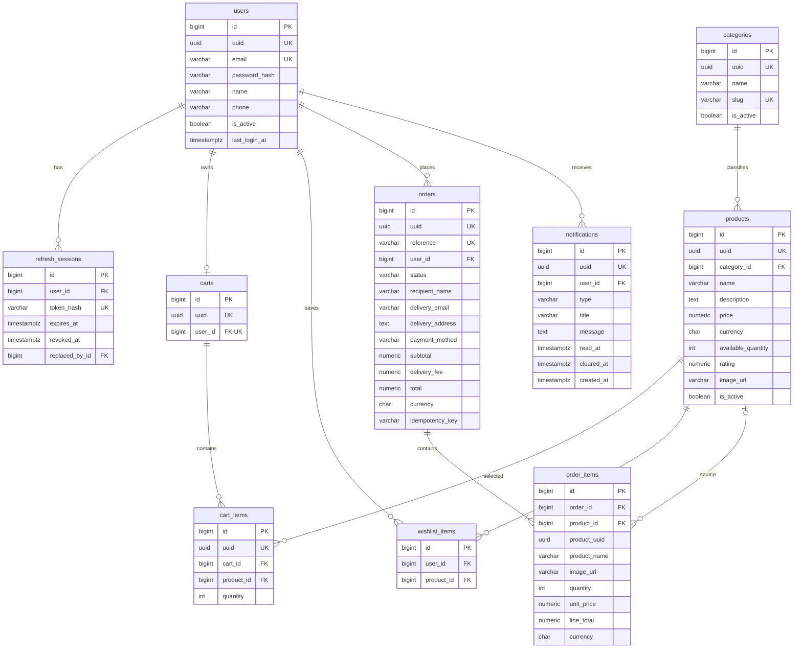

# Data model

## 1. Overview

Proposed PostgreSQL relational model for the current authentication, profile, catalog, cart,
wishlist, order, and notification scope.

Companion documents:

- [API conventions](api-convention.md)
- [API specification](api-specification.md)
- [Backend initialization blueprint](backend/backend-init-blueprint.md)

> **Status:** The model is a draft. Guest shopping, multi-currency, product variants, inventory
> reservations, card processing, and push delivery are deferred from v1.

## 2. Conventions

- Tables and columns use `snake_case`; tables are plural.
- Internal primary and foreign keys use `BIGINT`.
- API-addressable entities also have a unique public `UUID`.
- Mutable tables have `created_at` and `updated_at` as `TIMESTAMPTZ`.
- Money uses `NUMERIC(12,2)` and a three-character currency code.
- Enum-like fields use `VARCHAR` plus `CHECK` constraints.
- Passwords and refresh tokens are stored only as hashes.
- Cart totals are derived. Order prices and totals are stored snapshots.
- Applied migrations are sequential and are never edited.

## 3. Main entities

| Group | Entities |
|---|---|
| Identity | `users`, `refresh_sessions` |
| Catalog | `categories`, `products` |
| Shopping | `carts`, `cart_items`, `wishlist_items` |
| Orders | `orders`, `order_items` |
| Notifications | `notifications` |

Deferred entities: product variants, reviews, saved addresses, inventory movements, promotions,
payments, shipments, returns, notification preferences, and audit entries.

## 4. Entity relationship diagram



## 5. DDL

The DDL below is the proposed canonical schema. Once migrations exist, this section must be updated
in the same change as each migration.

### 5.1 Identity — `V1` and `V2`

```sql
-- V1__create_users.sql
CREATE TABLE users (
    id              BIGSERIAL    PRIMARY KEY,
    uuid            UUID         NOT NULL UNIQUE,
    email           VARCHAR(255) NOT NULL,
    password_hash   VARCHAR(255) NOT NULL,
    name            VARCHAR(120) NOT NULL,
    phone           VARCHAR(32),
    is_active       BOOLEAN      NOT NULL DEFAULT TRUE,
    last_login_at   TIMESTAMPTZ,
    created_at      TIMESTAMPTZ  NOT NULL,
    updated_at      TIMESTAMPTZ  NOT NULL
);

CREATE UNIQUE INDEX uq_users_email ON users (lower(email));

-- V2__create_refresh_sessions.sql
CREATE TABLE refresh_sessions (
    id              BIGSERIAL    PRIMARY KEY,
    user_id         BIGINT       NOT NULL REFERENCES users(id) ON DELETE RESTRICT,
    token_hash      VARCHAR(255) NOT NULL UNIQUE,
    expires_at      TIMESTAMPTZ  NOT NULL,
    revoked_at      TIMESTAMPTZ,
    replaced_by_id  BIGINT       REFERENCES refresh_sessions(id) ON DELETE SET NULL,
    created_at      TIMESTAMPTZ  NOT NULL
);

CREATE INDEX ix_refresh_sessions_user ON refresh_sessions (user_id);
CREATE INDEX ix_refresh_sessions_active
    ON refresh_sessions (user_id, expires_at)
    WHERE revoked_at IS NULL;
```

### 5.2 Catalog — `V3`

```sql
-- V3__create_catalog.sql
CREATE TABLE categories (
    id          BIGSERIAL    PRIMARY KEY,
    uuid        UUID         NOT NULL UNIQUE,
    name        VARCHAR(120) NOT NULL,
    slug        VARCHAR(140) NOT NULL UNIQUE,
    is_active   BOOLEAN      NOT NULL DEFAULT TRUE,
    created_at  TIMESTAMPTZ  NOT NULL,
    updated_at  TIMESTAMPTZ  NOT NULL
);

CREATE TABLE products (
    id                  BIGSERIAL      PRIMARY KEY,
    uuid                UUID           NOT NULL UNIQUE,
    category_id         BIGINT         NOT NULL REFERENCES categories(id) ON DELETE RESTRICT,
    name                VARCHAR(180)   NOT NULL,
    description         TEXT,
    price               NUMERIC(12,2)  NOT NULL,
    currency            CHAR(3)        NOT NULL DEFAULT 'USD',
    available_quantity  INTEGER        NOT NULL DEFAULT 0,
    rating              NUMERIC(2,1),
    image_url           VARCHAR(2048),
    is_active           BOOLEAN        NOT NULL DEFAULT TRUE,
    created_at          TIMESTAMPTZ    NOT NULL,
    updated_at          TIMESTAMPTZ    NOT NULL,

    CONSTRAINT chk_products_price
        CHECK (price >= 0),
    CONSTRAINT chk_products_quantity
        CHECK (available_quantity >= 0),
    CONSTRAINT chk_products_rating
        CHECK (rating IS NULL OR rating BETWEEN 0 AND 5),
    CONSTRAINT chk_products_currency
        CHECK (currency ~ '^[A-Z]{3}$')
);

CREATE INDEX ix_categories_active_name
    ON categories (name, id)
    WHERE is_active;

CREATE INDEX ix_products_category_created
    ON products (category_id, created_at DESC, id DESC)
    WHERE is_active;

CREATE INDEX ix_products_name
    ON products (lower(name), id)
    WHERE is_active;
```

The product-name index is the initial search index. Replace it with PostgreSQL full-text or trigram
search only when the matching requirements are approved.

### 5.3 Cart and wishlist — `V4`

```sql
-- V4__create_cart_and_wishlist.sql
CREATE TABLE carts (
    id          BIGSERIAL    PRIMARY KEY,
    uuid        UUID         NOT NULL UNIQUE,
    user_id     BIGINT       NOT NULL UNIQUE REFERENCES users(id) ON DELETE CASCADE,
    created_at  TIMESTAMPTZ  NOT NULL,
    updated_at  TIMESTAMPTZ  NOT NULL
);

CREATE TABLE cart_items (
    id          BIGSERIAL    PRIMARY KEY,
    uuid        UUID         NOT NULL UNIQUE,
    cart_id     BIGINT       NOT NULL REFERENCES carts(id) ON DELETE CASCADE,
    product_id  BIGINT       NOT NULL REFERENCES products(id) ON DELETE RESTRICT,
    quantity    INTEGER      NOT NULL,
    created_at  TIMESTAMPTZ  NOT NULL,
    updated_at  TIMESTAMPTZ  NOT NULL,

    CONSTRAINT chk_cart_items_quantity
        CHECK (quantity > 0),
    CONSTRAINT uq_cart_items_product
        UNIQUE (cart_id, product_id)
);

CREATE TABLE wishlist_items (
    id          BIGSERIAL    PRIMARY KEY,
    user_id     BIGINT       NOT NULL REFERENCES users(id) ON DELETE CASCADE,
    product_id  BIGINT       NOT NULL REFERENCES products(id) ON DELETE RESTRICT,
    created_at  TIMESTAMPTZ  NOT NULL,

    CONSTRAINT uq_wishlist_items_product
        UNIQUE (user_id, product_id)
);

CREATE INDEX ix_cart_items_cart
    ON cart_items (cart_id, created_at, id);

CREATE INDEX ix_wishlist_items_user_created
    ON wishlist_items (user_id, created_at DESC, id DESC);
```

Cart `lineTotal`, `subtotal`, and `itemCount` are calculated from the cart items and current product
prices; they are not stored.

### 5.4 Orders — `V5`

```sql
-- V5__create_orders.sql
CREATE TABLE orders (
    id                BIGSERIAL      PRIMARY KEY,
    uuid              UUID           NOT NULL UNIQUE,
    reference         VARCHAR(32)    NOT NULL UNIQUE,
    user_id           BIGINT         NOT NULL REFERENCES users(id) ON DELETE RESTRICT,
    status            VARCHAR(24)    NOT NULL DEFAULT 'PENDING',
    recipient_name    VARCHAR(120)   NOT NULL,
    delivery_email    VARCHAR(255)   NOT NULL,
    delivery_address  TEXT           NOT NULL,
    payment_method    VARCHAR(32)    NOT NULL,
    subtotal          NUMERIC(12,2)  NOT NULL,
    delivery_fee      NUMERIC(12,2)  NOT NULL,
    total             NUMERIC(12,2)  NOT NULL,
    currency          CHAR(3)        NOT NULL,
    idempotency_key   VARCHAR(128)   NOT NULL,
    created_at        TIMESTAMPTZ    NOT NULL,
    updated_at        TIMESTAMPTZ    NOT NULL,

    CONSTRAINT uq_orders_user_idempotency
        UNIQUE (user_id, idempotency_key),
    CONSTRAINT chk_orders_status
        CHECK (status IN ('PENDING', 'CONFIRMED', 'SHIPPED', 'DELIVERED')),
    CONSTRAINT chk_orders_payment_method
        CHECK (payment_method IN ('CASH_ON_DELIVERY')),
    CONSTRAINT chk_orders_amounts
        CHECK (subtotal >= 0 AND delivery_fee >= 0 AND total = subtotal + delivery_fee),
    CONSTRAINT chk_orders_currency
        CHECK (currency ~ '^[A-Z]{3}$')
);

CREATE TABLE order_items (
    id            BIGSERIAL      PRIMARY KEY,
    order_id      BIGINT         NOT NULL REFERENCES orders(id) ON DELETE RESTRICT,
    product_id    BIGINT         REFERENCES products(id) ON DELETE SET NULL,
    product_uuid  UUID           NOT NULL,
    product_name  VARCHAR(180)   NOT NULL,
    image_url     VARCHAR(2048),
    quantity      INTEGER        NOT NULL,
    unit_price    NUMERIC(12,2)  NOT NULL,
    line_total    NUMERIC(12,2)  NOT NULL,
    currency      CHAR(3)        NOT NULL,
    created_at    TIMESTAMPTZ    NOT NULL,

    CONSTRAINT chk_order_items_quantity
        CHECK (quantity > 0),
    CONSTRAINT chk_order_items_amounts
        CHECK (unit_price >= 0 AND line_total = quantity * unit_price),
    CONSTRAINT chk_order_items_currency
        CHECK (currency ~ '^[A-Z]{3}$')
);

CREATE INDEX ix_orders_user_created
    ON orders (user_id, created_at DESC, id DESC);

CREATE INDEX ix_order_items_order
    ON order_items (order_id, id);
```

`order_items` stores product and price snapshots. Product changes or deletion must not rewrite an
existing order.

### 5.5 Notifications — `V6`

```sql
-- V6__create_notifications.sql
CREATE TABLE notifications (
    id          BIGSERIAL    PRIMARY KEY,
    uuid        UUID         NOT NULL UNIQUE,
    user_id     BIGINT       NOT NULL REFERENCES users(id) ON DELETE CASCADE,
    type        VARCHAR(24)  NOT NULL,
    title       VARCHAR(160) NOT NULL,
    message     TEXT         NOT NULL,
    read_at     TIMESTAMPTZ,
    cleared_at  TIMESTAMPTZ,
    created_at  TIMESTAMPTZ  NOT NULL,

    CONSTRAINT chk_notifications_type
        CHECK (type IN ('ORDER', 'OFFER', 'STOCK'))
);

CREATE INDEX ix_notifications_user_created
    ON notifications (user_id, created_at DESC, id DESC)
    WHERE cleared_at IS NULL;

CREATE INDEX ix_notifications_user_unread
    ON notifications (user_id, created_at DESC, id DESC)
    WHERE read_at IS NULL AND cleared_at IS NULL;
```

`read_at = NULL` means unread. Clearing sets `cleared_at`; it does not immediately delete the row.

## 6. Stored values

| Column | Database values | API values |
|---|---|---|
| `orders.status` | `PENDING`, `CONFIRMED`, `SHIPPED`, `DELIVERED` | `pending`, `confirmed`, `shipped`, `delivered` |
| `orders.payment_method` | `CASH_ON_DELIVERY` | `cash_on_delivery` |
| `notifications.type` | `ORDER`, `OFFER`, `STOCK` | `order`, `offer`, `stock` |

Card payment, cancellation, returns, push delivery, and notification preferences are deferred.

## 7. Migration order

| Migration | Creates |
|---|---|
| `V1__create_users.sql` | `users` |
| `V2__create_refresh_sessions.sql` | `refresh_sessions` |
| `V3__create_catalog.sql` | `categories`, `products` |
| `V4__create_cart_and_wishlist.sql` | `carts`, `cart_items`, `wishlist_items` |
| `V5__create_orders.sql` | `orders`, `order_items` |
| `V6__create_notifications.sql` | `notifications` |

## 8. Deferred post-v1 decisions

| Decision | Interim model |
|---|---|
| Guest cart and wishlist | V1 uses authenticated ownership only. |
| Multi-currency | V1 uses USD only. |
| Product variants | One product row with one price and quantity. |
| Inventory reservations | Validate and decrement during order creation. |
| Saved/structured addresses | V1 stores a text snapshot on each order. |
| Delivery methods and fees | V1 standard delivery is USD 4.00. |
| Payment processing | V1 uses cash on delivery; no payment table. |
| Rating source | Nullable product value; reviews are deferred. |
| Push notifications | V1 is an in-app inbox only. |
