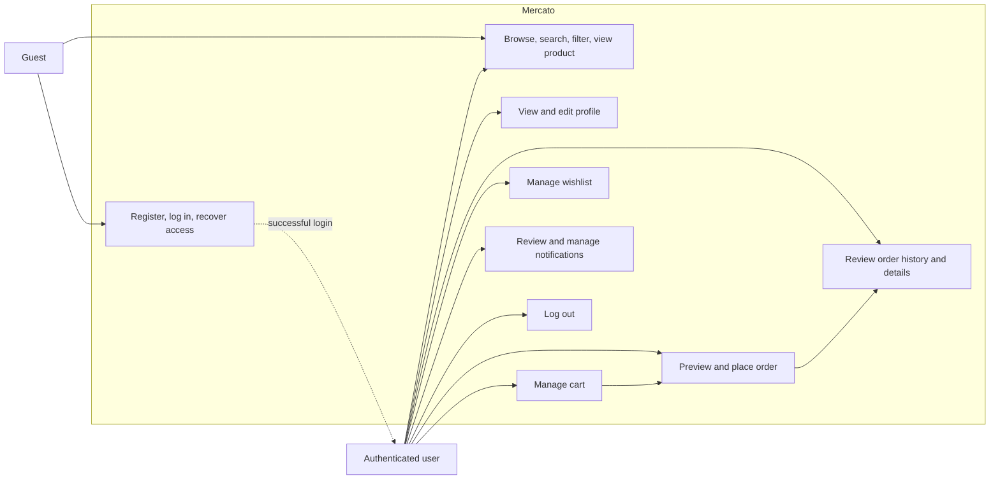
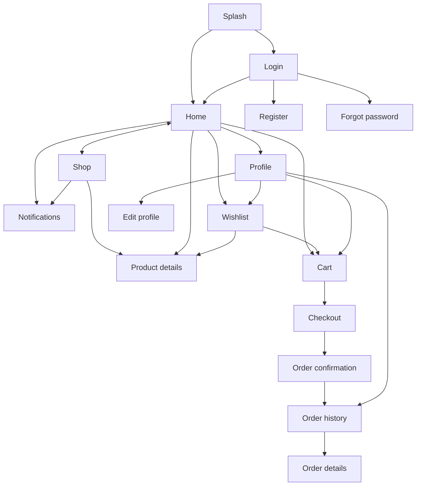

# Use cases

## 1. Overview

This document defines the user interactions in the v1 customer-facing e-commerce application. It is
the behavioral bridge between [project requirements](requirement.md), feature specifications, the
prototype, and API contracts.

## 2. Actors

| Actor | Description |
|---|---|
| Guest | An unauthenticated visitor who can access account flows and browse the public catalog. |
| Authenticated user | A registered customer with access to profile, cart, wishlist, checkout, orders, and notifications. |
| System | The backend services that validate identity, pricing, stock, ownership, and order state. |

## 3. Use-case diagram

## 4. Use-case summary

| ID | Use case | Actor | Outcome |
|---|---|---|---|
| UC-001 | Start application | Guest or authenticated user | User reaches login or home according to session state. |
| UC-002 | Register | Guest | Account is created and the user is signed in. |
| UC-003 | Log in | Guest | Valid credentials create an authenticated session. |
| UC-004 | Request password recovery | Guest | A neutral recovery acknowledgement is displayed. |
| UC-005 | Browse and search products | Guest or authenticated user | Matching visible products are displayed. |
| UC-006 | View product details | Guest or authenticated user | Product details and current stock are displayed. |
| UC-007 | Manage profile | Authenticated user | Current profile is viewed or updated. |
| UC-008 | Manage cart | Authenticated user | Eligible products and quantities are added, changed, or removed. |
| UC-009 | Manage wishlist | Authenticated user | Products are saved or removed. |
| UC-010 | Preview checkout | Authenticated user | Delivery input, cart, stock, and totals are validated. |
| UC-011 | Place order | Authenticated user | One order is created and confirmation is displayed. |
| UC-012 | Review orders | Authenticated user | Owned order history and details are displayed. |
| UC-013 | Manage notifications | Authenticated user | Notifications are reviewed, marked read, or cleared. |
| UC-014 | Log out | Authenticated user | All account tokens are revoked and login is displayed. |

## 5. Detailed use-case flows

### UC-001 — Start application

**Precondition:** The application is installed or opened in a supported environment.

**Main flow:**

1. The user opens the application.
2. The splash screen appears while local session state is checked.
3. If a refresh session exists, the system attempts to restore the session.
4. The application opens Home for a valid session or Login otherwise.

**Alternative flow:** If the service is unavailable, the application shows a retryable error and does
not assume the user is authenticated.

### UC-002 — Register

**Precondition:** The actor is a guest.

**Main flow:**

1. The guest opens Register from Login.
2. The guest enters name, email, password, and password confirmation.
3. The application validates required fields, email format, password length, and matching passwords.
4. The system creates the account when the normalized email is unused.
5. The system creates an access token and refresh session.
6. The application opens Home.

**Alternative flows:**

- An existing email returns `EMAIL_ALREADY_REGISTERED`; the form remains populated except passwords.
- Invalid input is shown beside the relevant fields.

### UC-003 — Log in

**Precondition:** The actor has an active account.

**Main flow:**

1. The guest enters email and password.
2. The application disables repeated submission and shows progress.
3. The system validates the credentials without revealing which value was wrong.
4. The system returns an access token, refresh token, and user profile.
5. The application opens Home.

**Alternative flows:** Invalid credentials keep the user on Login; a disabled account displays an
account-disabled message; service failure preserves the email and permits retry.

### UC-004 — Request password recovery

1. The guest opens Forgot password and submits an email.
2. The system always returns the same acknowledgement whether the account exists or not.
3. The application displays that acknowledgement.

Recovery delivery and reset completion are deferred until an email provider is selected.

### UC-005 — Browse and search products

1. The actor opens Home or Shop.
2. The system returns visible products and active categories.
3. The actor optionally enters a search query, selects a category, availability filter, or sort.
4. The application displays the matching page or a no-results state.
5. The actor may clear filters or select a product.

### UC-006 — View product details

1. The actor selects a product card.
2. The application displays name, category, price, rating when present, current available quantity,
   image when present, and description when present.
3. Quantity begins at one and cannot exceed available stock.
4. A product with zero available quantity cannot be added to the cart.

### UC-007 — Manage profile

**Precondition:** The actor is authenticated.

1. The user opens Profile and selects Edit profile.
2. The application shows current name, email, and optional phone.
3. The user changes approved fields and saves.
4. The system validates uniqueness and formatting, then returns the updated profile.
5. The profile screen reflects the saved values.

Canceling edit discards unsaved changes.

### UC-008 — Manage cart

**Precondition:** The actor is authenticated.

1. The user adds an in-stock product from Home, Shop, Product details, or Wishlist.
2. The system adds a new cart line or increases its existing quantity.
3. The header and navigation cart badges update to the total quantity.
4. The user may set a valid quantity or remove a line.
5. The system returns the complete cart with recalculated current-price totals.

**Alternative flows:** Out-of-stock or insufficient-stock changes are refused without corrupting the
existing cart. An empty cart displays a route back to Shop.

### UC-009 — Manage wishlist

**Precondition:** The actor is authenticated.

1. The user saves an eligible product from a product surface.
2. The product appears once in the wishlist; saving it again does not create a duplicate.
3. The user may open the product or remove it from the wishlist.
4. An empty wishlist displays a route back to Shop.

### UC-010 — Preview checkout

**Precondition:** The user is authenticated and the cart is not empty.

1. The user opens Checkout from the cart.
2. The user enters recipient name, delivery email, and delivery address.
3. The system revalidates product availability and current prices.
4. The system returns subtotal, USD 4.00 standard-delivery fee, and total.
5. The application presents the final summary before order submission.

Cash on delivery is the v1 production method. Card selection in the prototype is demonstrative only.

### UC-011 — Place order

**Precondition:** UC-010 succeeds.

1. The user selects Place order once.
2. The application sends a unique idempotency key and disables repeated submission.
3. In one transaction, the system validates stock, creates the order and immutable item snapshots,
   decrements stock, and removes purchased cart items.
4. The system returns the created `pending` order.
5. The application opens Order confirmation.

**Alternative flows:** If stock changed, the order is not created and the user returns to a
recoverable checkout state. Repeating the same request does not create a second order.

### UC-012 — Review orders

1. The user opens Order history from Profile or Order confirmation.
2. The system returns the user's orders newest first.
3. The user selects an order card.
4. The system returns that owned order and its item, delivery, payment, total, and status snapshots.
5. The application displays Order details.

An absent order and another user's order both return `ORDER_NOT_FOUND`.

### UC-013 — Manage notifications

1. The user selects the notification indicator on Home or Shop.
2. The system returns visible notifications newest first and the unread count.
3. The user may filter to unread notifications.
4. The user may mark one or all notifications as read.
5. The user may clear the inbox.
6. The screen updates the unread count and empty state immediately.

### UC-014 — Log out

1. The user selects Sign out from Profile.
2. The system revokes all access and refresh tokens issued to the account.
3. The application removes local tokens and returns to Login.

## 6. Navigation map

## 7. Cross-cutting alternate flows

- **Unauthenticated access:** Protected screens redirect to Login and preserve the intended
  destination where practical.
- **Expired access token:** The client performs one refresh attempt, retries the original request once,
  and returns to Login if refresh fails.
- **Offline/service failure:** Preserve recoverable input, show a clear error, and offer retry.
- **Empty result:** Show a feature-specific empty state and a useful next action.
- **Duplicate action:** Disable mutation controls while pending; order creation also uses server-side
  idempotency.
- **Ownership failure:** Return the area's `*_NOT_FOUND` code without revealing another user's data.
